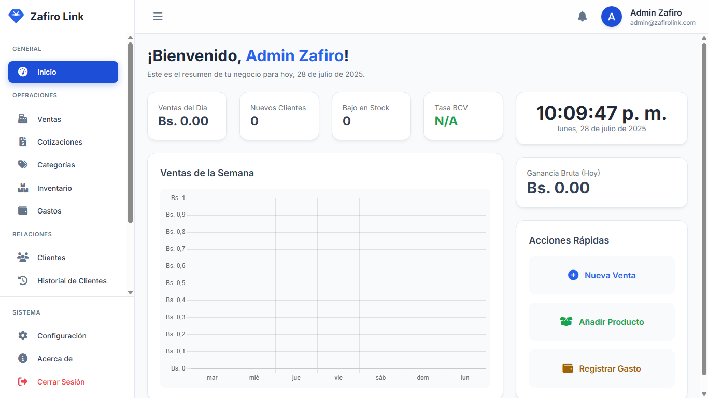

  

<h1 align="center">Zafiro Link</h1>

  <strong>El Sistema Operativo de Punto de Venta (POS) gratuito y de código abierto para tu negocio.</strong>
   
  <a href="zafiro.link.web.app"><strong>Visita nuestra página web »</strong></a>
    
  <a href="https://github.com/anzoategui-oficial/safirolink/issues">Reportar un Bug</a>
  ·
  <a href="https://github.com/anzoategui-oficial/safirolink/issues">Sugerir una Característica</a>

  

---

## Sobre el Proyecto

Zafiro Link es una solución de Punto de Venta (POS) completa, diseñada para ser potente, fácil de usar y accesible para todos. Se instala directamente en tu computadora (Windows), manteniendo tus datos 100% privados y bajo tu control.

## ✨ Características Principales

* ✅ **Punto de Venta Intuitivo:** Procesa ventas rápidamente.
* 📦 **Gestión de Inventario:** Control total sobre tu stock.
* 📊 **Reportes y Analítica:** Toma decisiones basadas en datos.
* 👥 **Módulo de Clientes (CRM):** Fideliza a tus clientes.
* 🤖 **Asistente IA Gemini:** Obtén pronósticos y sugerencias inteligentes.
* 📄 **Cotizaciones y Facturas:** Crea y gestiona documentos profesionales.
* 🔒 **100% Local y Privado:** Tus datos nunca salen de tu computadora.
* ❤️ **Gratuito y de Código Abierto:** Sin costos, sin licencias, para siempre.

## 🚀 Instalación

1.  Ve a la sección de **[Releases](https://github.com/anzoategui-oficial/safirolink/releases)**.
2.  Descarga el archivo `.exe` de la última versión.
3.  Ejecuta el instalador y sigue las instrucciones. ¡Listo!

## 🤝 Cómo Contribuir

¡Las contribuciones son el corazón de los proyectos de código abierto! Agradecemos cualquier ayuda que puedas ofrecer. Por favor, lee nuestra **[guía para contribuir](CONTRIBUTING.md)** para empezar.

## 📜 Licencia

Distribuido bajo la Licencia MIT. Ver `LICENSE` para más información.
